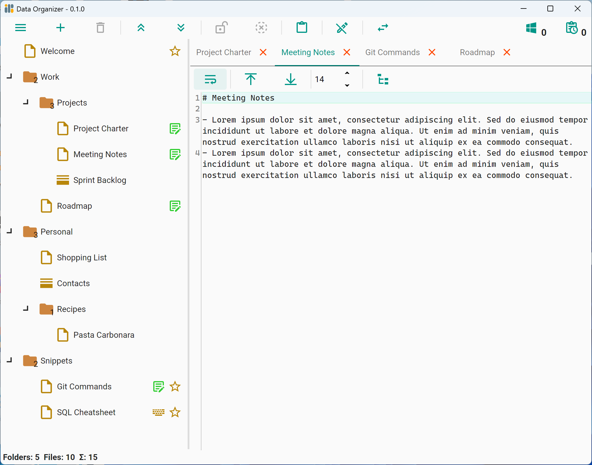
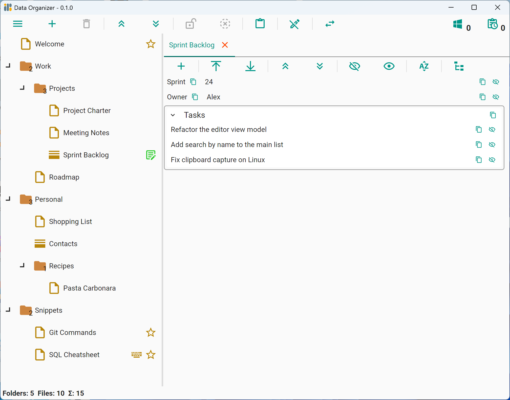
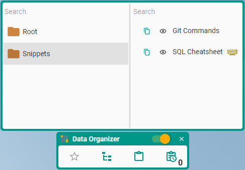
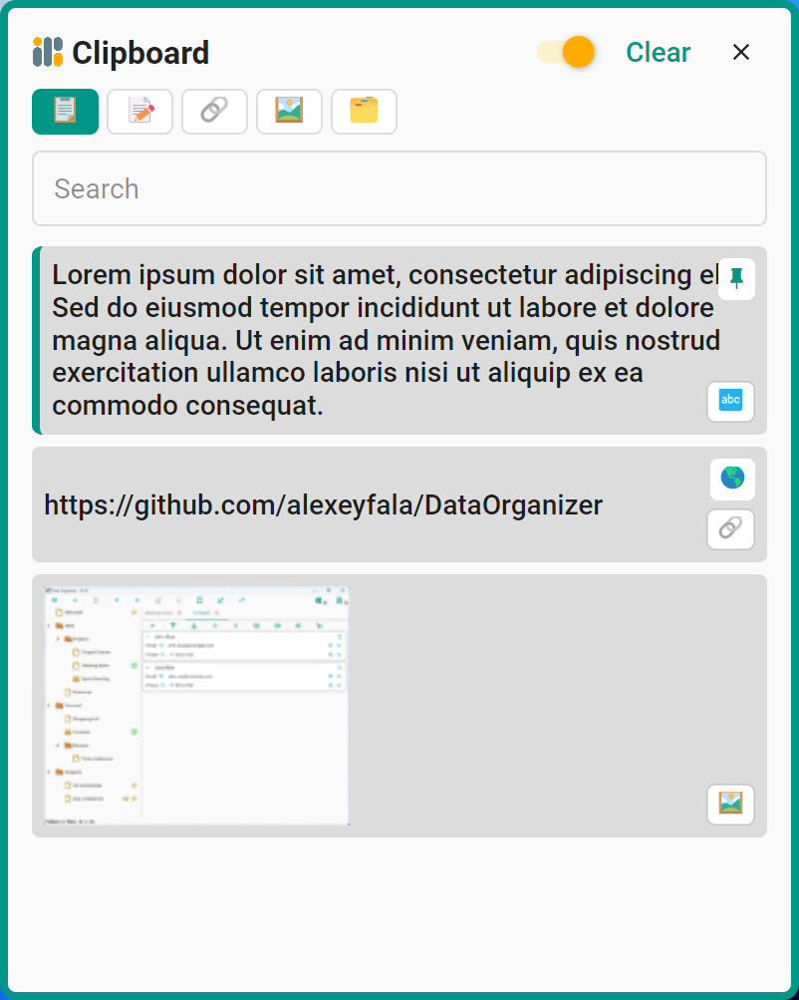

# Data Organizer

[](LICENSE)


**A cross-platform desktop application for organizing and securely storing structured data in a virtual file system.**

Built with [Avalonia UI](https://avaloniaui.net/) and .NET 10, following the MVVM pattern with data persisted to a local SQLite database via EF Core.

## Features

- **Virtual file system** — folders, files, and datasets arranged in a tree, saved to a local SQLite database.
- **Global hotkeys** — bind a file to a Ctrl/Alt/Shift shortcut; pressing it from any application copies the file's contents to the clipboard.
- **Favorites** — mark files for quick access; a dedicated searchable window groups them by parent folder.
- **Encryption** — password-protect folders. Passwords are hashed with BCrypt; contents are encrypted with XChaCha20-Poly1305 using a per-folder Data Encryption Key (DEK).
- **Datasets** — structured key-value records with a built-in editor for grouping and editing.
- **Clipboard history** — a cross-platform journal that captures plain text, formatted text (HTML/RTF), URLs, images, and files/folders. Entries can be browsed, searched, and restored; duplicates are merged, the list is capped, and password-manager secrets are skipped. Kept in memory by default, optionally persisted to an encrypted file (XChaCha20-Poly1305 + Argon2id).
- **File execution** — launch files with their OS-default application; execution history is tracked.
- **Import & export** — JSON, XML, and the full SQLite database.
- **Appearance** — Light, Dark, or System theme (Material Design), with configurable primary and secondary accent colors.
- **Localization** — English and Russian; resource-based, ready for additional languages.

## Screenshots

**Main window** — hierarchical tree with the built-in text editor.



**Dataset editor** — structured key-value records and groups.



**Favorites** — quick access, grouped by parent folder.



**Clipboard history** — captured text, links, images, and files.




## System Requirements

64-bit (x64) only. Builds are self-contained, so requirements follow the bundled .NET 10 runtime:

- **Windows** — Windows 10 version 1607 or later
- **macOS** — macOS 12 (Monterey) or later (Apple Silicon via Rosetta 2)
- **Linux** — a modern glibc-based distribution (e.g. Ubuntu 22.04+, Debian 12+, Fedora 42+); see [.NET 10 supported distributions](https://github.com/dotnet/core/blob/main/release-notes/10.0/supported-os.md)

## Build from Source

**Prerequisites:** [.NET 10 SDK](https://dotnet.microsoft.com/download/dotnet/10.0).

```bash
git clone https://github.com/alexeyfala/DataOrganizer.git
cd DataOrganizer
dotnet run --project DataOrganizer.Desktop
```

On macOS, run the platform host instead:

```bash
dotnet run --project DataOrganizer.MacOS
```

## Data Storage

All application data is stored locally:

```
%LOCALAPPDATA%/DataOrganizer/                                 (Windows)
/home/{username}/.local/share/DataOrganizer/                  (Linux)
/Users/{username}/Library/Application Support/DataOrganizer/  (macOS)
```

## Contributing

Contributions are welcome. See [CONTRIBUTING.md](CONTRIBUTING.md) for build and workflow guidelines, and the [Code of Conduct](CODE_OF_CONDUCT.md).

## Security

Vulnerability reports are handled privately — see [SECURITY.md](SECURITY.md). Avoid filing public issues for security matters.

## License

Data Organizer is licensed under the **Apache License 2.0** — see the [LICENSE](LICENSE) file for the full text.

Third-party components are distributed under their own licenses; attribution and terms are listed in [THIRD-PARTY-NOTICES.txt](THIRD-PARTY-NOTICES.txt). Notably, the global-hotkey feature relies on the native `libuiohook` library (bundled with SharpHook), which is licensed under the **LGPL-3.0-or-later** and is linked dynamically. Required attribution notices are collected in the [NOTICE](NOTICE) file.
